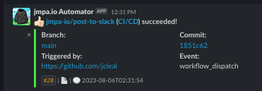

<!-- markdownlint-disable MD041 MD010 MD034 -->
[](https://github.com/jmpa-io/post-to-slack/actions/workflows/README.yml)
[](https://github.com/jmpa-io/post-to-slack/actions/workflows/cicd.yml)

<p align="center">
  
</p>

# `post-to-slack`

```diff
+ 🐋 A GitHub Action for sending notifications from running jobs to Slack (via a
+ given webhook).
```

* Inspired by [action-slack by 8398a7](https://github.com/8398a7/action-slack); Created using [this doc](https://docs.github.com/en/free-pro-team@latest/actions/creating-actions/creating-a-docker-container-action) from GitHub.

## `usage`

General:

```yaml
- name: Post to Slack.
  uses: jmpa-io/post-to-slack@main
  with:
    webhook: ${{ secrets.SLACK_WEBHOOK_URL }}
    status: ${{ job.status }}
```
> If you're unsure how to create the `${{ secrets.SLACK_WEBHOOK_URL }}`, see [this doc from Slack around creating a custom Slack App for your Slack workspace](ttps://api.slack.com/messaging/webhooks).

> If you're unsure how to retrieve the `${{ job.status }}`, see [this GitHub Action called `determine-workflow-conclusion`](https://github.com/jmpa-io/determine-workflow-conclusion).

With if conditionals ([see doc](https://docs.github.com/en/free-pro-team@latest/actions/reference/context-and-expression-syntax-for-github-actions#job-status-check-functions)):

```yaml
- name: Post to Slack.
  if: success() # accepts: success(), always(), cancelled(), failure()
  uses: jmpa-io/post-to-slack@main
  with:
    webhook: ${{ secrets.SLACK_WEBHOOK_URL }}
    status: ${{ job.status }}
```

## `inputs`

### (required) `webhook`

The Slack webhook to post to. This is created / managed
by a custom Slack App in your Slack workspace.

### (required) `status`

The status of the running GitHub Action job.
